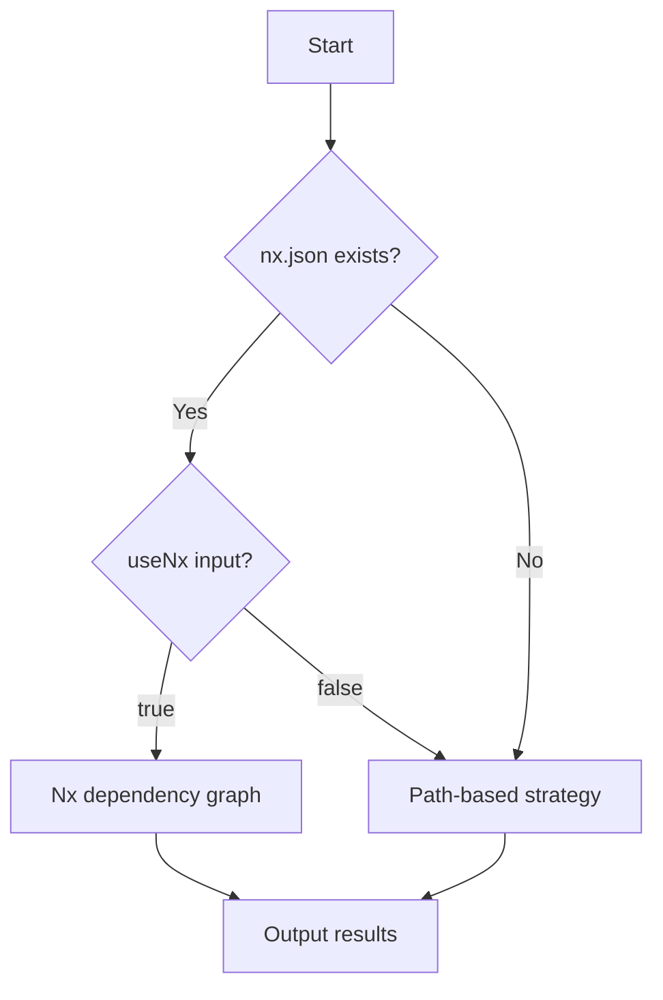

# Detect Changes Action

> **Intelligent change detection for monorepos and multi-domain projects**
>
> Automatically detects which parts of your codebase have changed using Nx dependency graphs or path-based filtering.

[](https://github.com/marketplace)
[](../../docs/strategy-agnostic-pattern.md)
[](../../../LICENSE)

## Features

- 🚀 **Dual Strategy Support**: Nx dependency graph + path-based fallback
- 📦 **Package Manager Agnostic**: Auto-detects pnpm, yarn, or npm
- 🎯 **Domain-Driven**: Organize code by business domains, not file structure
- ⚡ **Fast**: Intelligent caching and parallel execution
- 🔧 **Configurable**: Full control over detection behavior
- 📊 **Rich Outputs**: JSON results, affected domains, project lists

## Quick Start

### Basic Usage

```yaml
- name: Detect Changes
  id: changes
  uses: ./.github/actions/detect-changes
  with:
    domains-config: |
      frontend:
        paths:
          - 'apps/web/**'
          - 'libs/ui/**'
      backend:
        paths:
          - 'apps/api/**'
          - 'libs/database/**'
      docs:
        paths:
          - 'docs/**'
          - '*.md'

- name: Run Frontend Tests
  if: fromJSON(steps.changes.outputs.changes).frontend == true
  run: npm test --workspace=frontend

- name: Run Backend Tests
  if: fromJSON(steps.changes.outputs.changes).backend == true
  run: npm test --workspace=backend
```

### With Nx Monorepo

```yaml
- name: Detect Changes (Nx)
  id: changes
  uses: ./.github/actions/detect-changes
  with:
    baseRef: main
    useNx: true
    domains-config: |
      frontend:
        paths: ['apps/web/**']
      backend:
        paths: ['apps/api/**']
```

## Inputs

| Input | Description | Required | Default |
|-------|-------------|----------|---------|
| `domains-config` | YAML string defining domains and their paths | ✅ Yes | - |
| `baseRef` | Base reference to compare against | ❌ No | `main` |
| `useNx` | Use Nx dependency graph if available | ❌ No | `true` |
| `node-version` | Node.js version for Nx | ❌ No | `20` |
| `pnpm-version` | pnpm version (if using pnpm) | ❌ No | `9` |

### `domains-config` Format

```yaml
<domain-name>:
  paths:
    - '<glob-pattern>'
    - '<glob-pattern>'
<another-domain>:
  paths:
    - '<glob-pattern>'
```

**Example**:
```yaml
core:
  paths:
    - 'src/core/**'
    - 'libs/core/**'
api:
  paths:
    - 'apps/api/**'
    - 'src/api/**'
infrastructure:
  paths:
    - '.github/**'
    - 'terraform/**'
    - 'docker/**'
```

## Outputs

| Output | Description | Example |
|--------|-------------|---------|
| `changes` | JSON object with domain results | `{"frontend": true, "backend": false}` |
| `affectedDomains` | Comma-separated list of changed domains | `frontend,docs` |
| `nxAvailable` | Whether Nx was detected | `true` or `false` |
| `affectedProjects` | Comma-separated Nx projects (if using Nx) | `web,api,shared-ui` |

### Using Outputs

**JSON parsing**:
```yaml
- name: Check if frontend changed
  if: fromJSON(steps.changes.outputs.changes).frontend == true
  run: echo "Frontend changed!"
```

**List iteration**:
```yaml
- name: Deploy affected domains
  run: |
    IFS=',' read -ra DOMAINS <<< "${{ steps.changes.outputs.affectedDomains }}"
    for domain in "${DOMAINS[@]}"; do
      echo "Deploying $domain..."
      ./deploy.sh "$domain"
    done
```

**Matrix strategy**:
```yaml
jobs:
  detect:
    runs-on: ubuntu-latest
    outputs:
      domains: ${{ steps.changes.outputs.affectedDomains }}
    steps:
      - uses: actions/checkout@v4
      - id: changes
        uses: ./.github/actions/detect-changes
        with:
          domains-config: |
            # ... your config

  test:
    needs: detect
    strategy:
      matrix:
        domain: ${{ fromJSON(format('["{0}"]', needs.detect.outputs.domains)) }}
    runs-on: ubuntu-latest
    steps:
      - run: npm test --workspace=${{ matrix.domain }}
```

## How It Works

### Strategy 1: Nx Dependency Graph (Preferred)

When Nx is detected (`nx.json` exists), the action uses Nx's intelligent dependency graph:

```bash
npx nx show projects --affected --base=main
```

**Benefits**:
- 🔍 Understands project dependencies
- 🎯 Only runs tests for truly affected code
- ⚡ Faster CI with smart caching

**Mapping**:
The action maps Nx project names to domains using flexible matching:
- `frontend-web` → `frontend` domain
- `backend_api` → `backend` domain
- Handles `-` and `_` interchangeably

### Strategy 2: Path-Based (Fallback)

When Nx is not available, uses [dorny/paths-filter](https://github.com/dorny/paths-filter):

```yaml
frontend:
  - 'apps/web/**'
  - 'libs/ui/**'
```

**Benefits**:
- ✅ Works in any repository
- 📁 Simple glob pattern matching
- 🚀 No dependencies required

## Strategy Detection

The action automatically detects the best strategy:



**Override detection**:
```yaml
- uses: ./.github/actions/detect-changes
  with:
    useNx: false  # Force path-based even if Nx exists
```

## Package Manager Detection

The action auto-detects your package manager:

1. **pnpm** (if `pnpm-lock.yaml` exists)
   ```bash
   corepack enable
   pnpm install --frozen-lockfile
   ```

2. **yarn** (if `yarn.lock` exists)
   ```bash
   yarn install --frozen-lockfile
   ```

3. **npm** (if `package-lock.json` exists or default)
   ```bash
   npm ci || npm install
   ```

**No configuration needed!** Just use the lock file you prefer.

## Advanced Examples

### Conditional Job Execution

```yaml
jobs:
  detect-changes:
    runs-on: ubuntu-latest
    outputs:
      frontend: ${{ steps.changes.outputs.changes.frontend }}
      backend: ${{ steps.changes.outputs.changes.backend }}
    steps:
      - uses: actions/checkout@v4
        with:
          fetch-depth: 0  # Required for accurate change detection

      - name: Detect Changes
        id: changes
        uses: ./.github/actions/detect-changes
        with:
          baseRef: ${{ github.event.pull_request.base.ref || 'main' }}
          domains-config: |
            frontend:
              paths: ['apps/web/**', 'libs/ui/**']
            backend:
              paths: ['apps/api/**', 'libs/db/**']

  test-frontend:
    needs: detect-changes
    if: fromJSON(needs.detect-changes.outputs.frontend) == true
    runs-on: ubuntu-latest
    steps:
      - run: npm test --workspace=frontend

  test-backend:
    needs: detect-changes
    if: fromJSON(needs.detect-changes.outputs.backend) == true
    runs-on: ubuntu-latest
    steps:
      - run: npm test --workspace=backend
```

### With Custom Base Branch

```yaml
- name: Detect Changes (PR)
  uses: ./.github/actions/detect-changes
  with:
    baseRef: ${{ github.event.pull_request.base.ref }}
    domains-config: |
      # ... your config
```

### Nx Monorepo with Custom Node Version

```yaml
- name: Detect Changes
  uses: ./.github/actions/detect-changes
  with:
    useNx: true
    node-version: '18'
    pnpm-version: '8'
    domains-config: |
      # ... your config
```

### Debugging Output

```yaml
- name: Detect Changes
  id: changes
  uses: ./.github/actions/detect-changes
  with:
    domains-config: |
      # ... your config

- name: Debug Results
  run: |
    echo "Changes JSON: ${{ steps.changes.outputs.changes }}"
    echo "Affected domains: ${{ steps.changes.outputs.affectedDomains }}"
    echo "Nx available: ${{ steps.changes.outputs.nxAvailable }}"
    echo "Affected projects: ${{ steps.changes.outputs.affectedProjects }}"
```

## Domain Configuration Best Practices

### 1. Organize by Business Domain

```yaml
# ✅ Good: Business-focused
user-management:
  paths: ['apps/users/**', 'libs/auth/**']
payments:
  paths: ['apps/billing/**', 'libs/payment-gateway/**']
analytics:
  paths: ['apps/analytics/**', 'libs/metrics/**']
```

```yaml
# ❌ Bad: Technology-focused
frontend:
  paths: ['**/*.tsx', '**/*.css']
backend:
  paths: ['**/*.py']
```

### 2. Include Related Infrastructure

```yaml
api:
  paths:
    - 'apps/api/**'
    - 'libs/api-client/**'
    - 'docker/api.Dockerfile'     # Related infrastructure
    - '.github/workflows/api-*'   # Related CI/CD
```

### 3. Use Wildcards Wisely

```yaml
# Match all TypeScript files in a directory
frontend:
  paths: ['apps/web/**/*.{ts,tsx}']

# Match specific file types
docs:
  paths: ['**/*.md', '**/*.mdx']

# Match multiple top-level directories
shared:
  paths: ['libs/**', 'packages/**', 'common/**']
```

### 4. Handle Monorepo Packages

```yaml
# Nx workspace
web-app:
  paths: ['apps/web/**']
shared-ui:
  paths: ['libs/ui/**']

# Yarn/npm workspaces
workspace-a:
  paths: ['packages/a/**']
workspace-b:
  paths: ['packages/b/**']
```

## Troubleshooting

### Changes Not Detected

**Problem**: Action reports no changes even though files changed.

**Solutions**:
1. **Ensure fetch-depth is set**:
   ```yaml
   - uses: actions/checkout@v4
     with:
       fetch-depth: 0  # Required!
   ```

2. **Check base ref**:
   ```yaml
   - uses: ./.github/actions/detect-changes
     with:
       baseRef: ${{ github.event.pull_request.base.ref || 'main' }}
   ```

3. **Verify glob patterns**:
   ```yaml
   # Wrong: Missing **
   paths: ['apps/web/*.ts']

   # Correct: Recursive
   paths: ['apps/web/**/*.ts']
   ```

### Nx Detection Fails

**Problem**: Nx is installed but not detected.

**Solutions**:
1. **Check `nx.json` exists** in repository root
2. **Verify Nx in `package.json`**:
   ```json
   {
     "dependencies": {
       "nx": "^17.0.0"
     }
   }
   ```
3. **Force path-based mode**:
   ```yaml
   with:
     useNx: false
   ```

### Package Manager Errors

**Problem**: Dependencies fail to install.

**Solutions**:
1. **Lock file exists**:
   - pnpm: `pnpm-lock.yaml`
   - yarn: `yarn.lock`
   - npm: `package-lock.json`

2. **Correct corepack setup** (for pnpm):
   ```yaml
   - name: Enable Corepack
     run: corepack enable

   - uses: ./.github/actions/detect-changes
     with:
       pnpm-version: '9'
   ```

### JSON Parsing Errors

**Problem**: `fromJSON()` fails in workflows.

**Solution**: Ensure you're accessing the correct output:
```yaml
# ❌ Wrong
if: steps.changes.outputs.changes.frontend == true

# ✅ Correct
if: fromJSON(steps.changes.outputs.changes).frontend == true
```

## Performance Tips

### 1. Use Shallow Clones When Possible

```yaml
- uses: actions/checkout@v4
  with:
    fetch-depth: 50  # Last 50 commits (faster than 0)
```

### 2. Cache Dependencies

```yaml
- uses: actions/setup-node@v4
  with:
    cache: 'pnpm'  # or 'yarn', 'npm'
```

### 3. Skip Unnecessary Checks

```yaml
- name: Detect Changes
  # Skip on main branch (run all tests)
  if: github.ref != 'refs/heads/main'
  uses: ./.github/actions/detect-changes
```

### 4. Parallel Job Execution

```yaml
jobs:
  detect:
    # ... detect changes
    outputs:
      domains: ${{ steps.changes.outputs.affectedDomains }}

  test:
    needs: detect
    strategy:
      matrix:
        domain: ${{ fromJSON(...) }}
    # Tests run in parallel per domain
```

## Comparison with Other Tools

| Feature | This Action | paths-filter | turborepo | Nx |
|---------|-------------|--------------|-----------|-----|
| Strategy detection | ✅ Automatic | ❌ Manual | ⚠️ Turbo only | ⚠️ Nx only |
| Path-based | ✅ Yes | ✅ Yes | ❌ No | ⚠️ Limited |
| Dependency graph | ✅ Yes (Nx) | ❌ No | ✅ Yes | ✅ Yes |
| Package manager agnostic | ✅ Yes | ✅ Yes | ✅ Yes | ✅ Yes |
| Domain mapping | ✅ Yes | ⚠️ Manual | ⚠️ Manual | ⚠️ Manual |
| Unified output | ✅ JSON | ⚠️ Boolean | ⚠️ Custom | ⚠️ Custom |

## Real-World Examples

### E-commerce Platform

```yaml
- uses: ./.github/actions/detect-changes
  with:
    domains-config: |
      storefront:
        paths:
          - 'apps/store/**'
          - 'libs/product-catalog/**'
      checkout:
        paths:
          - 'apps/checkout/**'
          - 'libs/payment/**'
          - 'libs/cart/**'
      admin:
        paths:
          - 'apps/admin-dashboard/**'
          - 'libs/admin-api/**'
      infrastructure:
        paths:
          - 'terraform/**'
          - 'kubernetes/**'
          - '.github/workflows/**'
```

### SaaS Application

```yaml
- uses: ./.github/actions/detect-changes
  with:
    domains-config: |
      webapp:
        paths: ['packages/web/**']
      mobile:
        paths: ['packages/mobile/**']
      api:
        paths: ['packages/api/**', 'packages/graphql/**']
      workers:
        paths: ['packages/workers/**', 'packages/queue/**']
      docs:
        paths: ['docs/**', 'README.md', '*.md']
```

## FAQ

### Q: Can I use this without PipeCraft?

**A:** Yes! This action is fully decoupled and works in any repository. Just copy the action directory and use it.

### Q: Does this work with Turborepo?

**A:** Currently supports Nx and path-based. Turborepo support is planned. For now, use `useNx: false` for path-based detection.

### Q: What about Git submodules?

**A:** Submodules are supported. Ensure `submodules: true` in checkout:
```yaml
- uses: actions/checkout@v4
  with:
    submodules: true
```

### Q: Can I use multiple base refs?

**A:** One base ref per run. For multiple comparisons, run the action multiple times with different base refs.

### Q: How do I handle renamed files?

**A:** Renamed files are detected as changes in their new location. Git tracks renames automatically.

## Contributing

This action is part of the [PipeCraft](https://github.com/jamesvillarrubia/pipecraft) project.

**Found a bug?** [Open an issue](https://github.com/jamesvillarrubia/pipecraft/issues/new)

**Have a feature request?** [Start a discussion](https://github.com/jamesvillarrubia/pipecraft/discussions/new)

**Want to contribute?** See [CONTRIBUTING.md](../../../CONTRIBUTING.md)

## License

MIT License - see [LICENSE](../../../LICENSE) for details

## Related Documentation

- [Strategy-Agnostic Pattern](../../../docs/strategy-agnostic-pattern.md) - How this action implements multi-strategy support
- [Action Coupling Matrix](../../../docs/action-coupling-matrix.md) - Analysis of all PipeCraft actions
- [PipeCraft Documentation](../../../docs/) - Full documentation

---

**Made with ❤️ by the PipeCraft team**

🤖 Part of [PipeCraft](https://github.com/jamesvillarrubia/pipecraft) - Automated CI/CD pipeline generation
