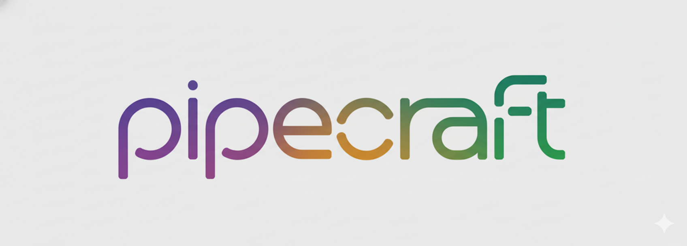

# PipeCraft

[](https://badge.fury.io/js/pipecraft)
[](https://github.com/jamesvillarrubia/pipecraft/blob/main/LICENSE)
[](https://github.com/jamesvillarrubia/pipecraft/actions)
[](https://codecov.io/gh/jamesvillarrubia/pipecraft)
[](https://www.npmjs.com/package/pipecraft)
[](https://nodejs.org/en/)

PipeCraft is a powerful CLI tool for automating trunk-based development workflows with GitHub Actions. It generates intelligent CI/CD pipelines that adapt to your codebase structure, support multiple domains (monorepos), handle semantic versioning, and manage branch flows with fast-forward merging strategies.

## Table of Contents
- [Features](#features)
- [Prerequisites](#prerequisites)
- [Quick Start](#quick-start)
- [Installation](#installation)
- [Usage](#usage)
  - [CLI Examples](#cli-examples)
  - [Configuration](#configuration)
- [Commands](#commands)
- [Pre-Flight Checks](#pre-flight-checks)
- [GitHub Actions Setup](#github-actions-setup)
- [Configuration Options](#configuration-options)
- [Domain-Based Workflows](#domain-based-workflows)
- [Version Management](#version-management)
- [Examples](#examples)
- [Roadmap & Future Features](#roadmap--future-features)
- [Troubleshooting](#troubleshooting)
- [Contributing](#contributing)
- [License](#license)
- [Acknowledgments](#acknowledgments)

## Features

- **Automatic CI/CD Pipeline Generation** - Generate GitHub Actions workflows tailored to your branch flow
- **Pre-Flight Checks** - Validates prerequisites before generating workflows with helpful error messages
- **Domain-Based Change Detection** - Smart path-based detection for monorepo architectures
- **Semantic Versioning** - Automatic version bumping based on conventional commits
- **Branch Flow Management** - Support for custom branch flows (develop → staging → main)
- **Fast-Forward Merging** - Automatic branch management with configurable merge strategies
- **Idempotent Regeneration** - Only regenerate when configuration or templates change
- **GitLab Support** - Works with both GitHub Actions and GitLab CI (configurable)
- **Customizable Actions** - Define actions per branch merge (tests, deploys, version bumps)
- **GitHub Setup Automation** - Automated token and repository setup validation

## Prerequisites

- Git
- A GitHub or GitLab account
- Node.js 18+ (for npm installation)

## Quick Start

1. Initialize PipeCraft in your project:
   ```bash
   npx pipecraft init --interactive
   ```

2. Generate your CI/CD workflows:
   ```bash
   npx pipecraft generate
   ```

3. Commit the generated files:
   ```bash
   git add .github/workflows .pipecraftrc.json
   git commit -m "chore: add PipeCraft workflows"
   git push
   ```

That's it! Your trunk-based development workflow is now automated.

## Installation

### Option 1: Using npx (recommended for trying it out)

No installation required! Just run commands with `npx`:

```bash
npx pipecraft init
```

### Option 2: Global installation via npm

```bash
npm install -g pipecraft
```

### Option 3: Local project installation

```bash
npm install --save-dev pipecraft
```

Then add to your `package.json` scripts:

```json
{
  "scripts": {
    "workflow:init": "pipecraft init",
    "workflow:generate": "pipecraft generate",
    "workflow:validate": "pipecraft validate"
  }
}
```

## Usage

### CLI Examples

PipeCraft provides several commands to manage your trunk-based development workflows:

#### 1. Initialize Configuration

Start with an interactive setup wizard:
```bash
pipecraft init --interactive
```

Or create a basic configuration:
```bash
pipecraft init --ci-provider github --initial-branch develop --final-branch main
```

Include version management setup:
```bash
pipecraft init --with-versioning
```

#### 2. Generate Workflows

Generate CI/CD workflows based on your configuration:
```bash
pipecraft generate
```

The generate command automatically runs pre-flight checks to validate:
- Configuration file exists and is valid
- Required fields are present (ciProvider, branchFlow, domains)
- Current directory is a git repository
- Git remote is configured
- .github/workflows directory is writable

If any check fails, you'll see helpful error messages with suggestions. Example output:
```
🔍 Running pre-flight checks...

✅ Configuration found: /path/to/.pipecraftrc.json
✅ Configuration is valid
❌ Not in a git repository
   💡 Initialize git: 'git init' or clone an existing repository
```

Skip pre-flight checks (not recommended):
```bash
pipecraft generate --skip-checks
```

Force regeneration (bypass cache):
```bash
pipecraft generate --force
```

Preview what would be generated (dry run):
```bash
pipecraft generate --dry-run
```

Use custom config and output paths:
```bash
pipecraft generate --config custom-config.json --output-pipeline .github/workflows/custom.yml
```

#### 3. Validate Configuration

Check if your configuration is valid:
```bash
pipecraft validate
```

Validate a custom config file:
```bash
pipecraft validate --config custom-config.json
```

#### 4. Verify Setup

Verify that PipeCraft is properly configured:
```bash
pipecraft verify
```

This checks:
- Configuration file exists and is valid
- GitHub Actions workflows exist (for GitHub projects)
- Repository structure is correct

#### 5. Version Management

Check current and next version:
```bash
pipecraft version --check
```

Bump version based on conventional commits:
```bash
pipecraft version --bump
```

Create a release:
```bash
pipecraft version --release
```

#### 6. Branch Setup

Create all branches defined in your branch flow:
```bash
pipecraft setup
```

This automatically creates and pushes all branches to your remote repository.

### Configuration

PipeCraft uses [cosmiconfig](https://github.com/davidtheclark/cosmiconfig) for flexible configuration discovery. It will look for configuration in the following order:

1. Command-line options
2. `.pipecraftrc.json` file
3. `.pipecraftrc` file
4. `pipecraft` key in `package.json`
5. Default values

Example `.pipecraftrc.json`:

```json
{
  "ciProvider": "github",
  "mergeStrategy": "fast-forward",
  "requireConventionalCommits": true,
  "initialBranch": "develop",
  "finalBranch": "main",
  "branchFlow": ["develop", "staging", "main"],
  "semver": {
    "bumpRules": {
      "feat": "minor",
      "fix": "patch",
      "breaking": "major"
    }
  },
  "actions": {
    "onDevelopMerge": ["runTests", "fastForwardToStaging"],
    "onStagingMerge": ["runTests", "calculateVersion", "createOrFastForwardToMain"]
  },
  "domains": {
    "api": {
      "paths": ["apps/api/**"],
      "description": "API application changes"
    },
    "web": {
      "paths": ["apps/web/**"],
      "description": "Web application changes"
    }
  }
}
```

## Commands

PipeCraft provides the following commands:

| Command | Description | Options |
|---------|-------------|---------|
| `init` | Initialize PipeCraft configuration | `--interactive`, `--force`, `--with-versioning`, `--ci-provider`, `--merge-strategy`, `--initial-branch`, `--final-branch` |
| `generate` | Generate CI/CD workflows with pre-flight checks | `--skip-checks`, `--force`, `--dry-run`, `--config`, `--output-pipeline`, `--verbose` |
| `validate` | Validate configuration file | `--config` |
| `validate:pipeline` | Validate generated pipeline files | `--strict` |
| `setup-github` | Configure GitHub Actions workflow permissions | `--apply`, `--force` |
| `verify` | Verify PipeCraft setup | None |
| `version` | Version management commands | `--check`, `--bump`, `--release` |
| `setup` | Create branches from branch flow | `--force` |

### Global Options

Available for all commands:

- `-c, --config <path>` - Path to config file (default: `.pipecraftrc.json`)
- `-p, --pipeline <path>` - Path to existing pipeline file for merging
- `-o, --output-pipeline <path>` - Path to output pipeline file
- `-v, --verbose` - Verbose output
- `--force` - Force operation even if unchanged
- `--dry-run` - Show what would be done without making changes

### Command Examples

```bash
# Initialize with all options
pipecraft init --interactive --with-versioning --ci-provider github

# Generate workflows with custom paths
pipecraft generate --config .pipecraft.json --output-pipeline workflows/ci.yml

# Validate pipeline files
pipecraft validate:pipeline

# Setup GitHub Actions permissions (interactive mode)
pipecraft setup-github

# Setup GitHub Actions permissions (auto-apply mode)
pipecraft setup-github --apply

# Validate before committing
pipecraft validate && git commit -am "chore: update workflow config"

# Check version and create release
pipecraft version --check
pipecraft version --bump
pipecraft version --release

# Setup all branches for new repository
pipecraft setup
```

## Pre-Flight Checks

PipeCraft includes comprehensive pre-flight validation to catch common errors before generating workflows. This helps new users avoid frustration and ensures your project is properly configured.

### What Gets Checked

When you run `pipecraft generate`, the following checks are automatically performed:

1. **Configuration File Discovery**
   - Searches for config using [cosmiconfig](https://github.com/davidtheclark/cosmiconfig)
   - Looks in: `.pipecraftrc.json`, `.pipecraftrc`, `package.json` (pipecraft key)
   - Searches parent directories recursively
   - Shows the exact path where config was found

2. **Configuration Validation**
   - Verifies JSON syntax is valid
   - Checks all required fields are present:
     - `ciProvider` (github or gitlab)
     - `branchFlow` (array of branch names)
     - `domains` (at least one domain configured)
   - Validates domain configuration has paths defined

3. **Git Repository Check**
   - Verifies current directory is a git repository
   - Suggests running `git init` if not

4. **Git Remote Check**
   - Verifies git remote is configured
   - Shows the remote URL
   - Suggests adding a remote if missing

5. **Write Permissions**
   - Tests that `.github/workflows` directory can be created/written to
   - Checks file system permissions

### Example Pre-Flight Output

**All checks passing:**
```
🔍 Running pre-flight checks...

✅ Configuration found: /path/to/project/.pipecraftrc.json
✅ Configuration is valid
✅ Current directory is a git repository
✅ Git remote configured: https://github.com/user/repo.git
✅ .github/workflows directory is writable

✅ All pre-flight checks passed!
```

**Checks failing with helpful suggestions:**
```
🔍 Running pre-flight checks...

❌ No PipeCraft configuration found
   💡 Run 'pipecraft init' to create a configuration file

❌ Not in a git repository
   💡 Initialize git: 'git init' or clone an existing repository

❌ No git remote configured
   💡 Add a remote: 'git remote add origin <url>'

❌ Pre-flight checks failed. Fix the issues above and try again.
   Or use --skip-checks to bypass (not recommended)
```

### Skipping Pre-Flight Checks

While not recommended, you can skip pre-flight checks if needed:

```bash
pipecraft generate --skip-checks
```

**When you might skip checks:**
- CI/CD environment with non-standard setup
- Using PipeCraft in a script/automation
- Advanced users who know the risks

**Why you shouldn't skip:**
- Prevents cryptic errors during generation
- Saves time by catching issues early
- Provides actionable error messages
- Ensures consistent behavior across environments

## GitHub Actions Setup

PipeCraft requires specific GitHub Actions permissions to function correctly. The `setup-github` command helps you configure these permissions easily.

### Required Permissions

PipeCraft workflows need:
- **Default workflow permissions: write** - For creating tags and pushing changes
- **Can create/approve pull requests: Yes** - For automated PR creation

### Usage

**Interactive Mode (Default)**

Prompts you for each permission change:

```bash
pipecraft setup-github
```

The command will:
1. Check your current repository permissions
2. Show what permissions are needed
3. Prompt you to apply each change
4. Update the permissions if you accept

**Auto-Apply Mode**

Automatically applies all required changes without prompting:

```bash
pipecraft setup-github --apply
# or
pipecraft setup-github --force
```

This mode is useful for:
- CI/CD pipeline setup scripts
- Automated repository initialization
- Batch configuration of multiple repositories

### Example Output

**Interactive mode:**
```
🔍 Checking GitHub repository configuration...

📦 Repository: user/repo
✅ GitHub token found
🔍 Fetching current workflow permissions...

📋 Current GitHub Actions Workflow Permissions:
   Default permissions: read
   Can create/approve PRs: No

⚠️  PipeCraft requires the following permissions:
   • Default permissions: write (for creating tags and pushing)
   • Can create/approve PRs: Yes (for automated PR creation)

? Change default workflow permissions from "read" to "write"? (Y/n)
```

**Auto-apply mode:**
```
🔍 Checking GitHub repository configuration...

📦 Repository: user/repo
✅ GitHub token found
🔍 Fetching current workflow permissions...

📋 Current GitHub Actions Workflow Permissions:
   Default permissions: read
   Can create/approve PRs: No

🔧 Applying required changes:
   • Setting default permissions to: write
   • Allowing PR creation/approval: true

🔄 Updating repository settings...
✅ GitHub Actions permissions updated successfully!
```

### Authentication

The command requires a GitHub token with admin access to your repository. It will automatically use:

1. `GITHUB_TOKEN` environment variable
2. `GH_TOKEN` environment variable
3. GitHub CLI (`gh`) authentication

To authenticate with GitHub CLI:
```bash
gh auth login
```

Or set an environment variable:
```bash
export GITHUB_TOKEN=ghp_your_token_here
```

### Manual Configuration

You can also configure these permissions manually:

1. Go to your repository on GitHub
2. Navigate to **Settings** → **Actions** → **General**
3. Under "Workflow permissions":
   - Select **Read and write permissions**
   - Check **Allow GitHub Actions to create and approve pull requests**
4. Click **Save**

## Configuration Options

### Core Configuration

| Option | Type | Required | Default | Description |
|--------|------|----------|---------|-------------|
| `ciProvider` | `'github' \| 'gitlab'` | Yes | `'github'` | CI/CD provider |
| `mergeStrategy` | `'fast-forward' \| 'merge'` | Yes | `'fast-forward'` | Branch merge strategy |
| `requireConventionalCommits` | `boolean` | No | `true` | Enforce conventional commits |
| `initialBranch` | `string` | Yes | `'develop'` | First branch in flow |
| `finalBranch` | `string` | Yes | `'main'` | Final production branch |
| `branchFlow` | `string[]` | Yes | - | Ordered list of branches |

### Semantic Versioning

| Option | Type | Description |
|--------|------|-------------|
| `semver.bumpRules.feat` | `'major' \| 'minor' \| 'patch'` | Version bump for features |
| `semver.bumpRules.fix` | `'major' \| 'minor' \| 'patch'` | Version bump for fixes |
| `semver.bumpRules.breaking` | `'major' \| 'minor' \| 'patch'` | Version bump for breaking changes |

### Actions

Define what happens on branch merges:

```json
{
  "actions": {
    "onDevelopMerge": [
      "runTests",
      "fastForwardToStaging"
    ],
    "onStagingMerge": [
      "runTests",
      "calculateVersion",
      "createOrFastForwardToMain"
    ]
  }
}
```

Available actions:
- `runTests` - Run test suite
- `fastForwardToStaging` - Fast-forward develop to staging
- `calculateVersion` - Calculate next semantic version
- `createOrFastForwardToMain` - Merge or fast-forward to main
- `deploy` - Run deployment steps

### Domains (Monorepo Support)

Define multiple domains for path-based change detection:

```json
{
  "domains": {
    "api": {
      "paths": ["apps/api/**", "libs/api-utils/**"],
      "description": "API application and utilities"
    },
    "web": {
      "paths": ["apps/web/**", "libs/ui-components/**"],
      "description": "Web application and UI components"
    },
    "mobile": {
      "paths": ["apps/mobile/**"],
      "description": "Mobile application"
    }
  }
}
```

Each domain can have:
- `paths` (required): Array of glob patterns for file matching
- `description` (optional): Human-readable description

### Versioning Configuration

```json
{
  "versioning": {
    "enabled": true,
    "releaseItConfig": ".release-it.cjs",
    "conventionalCommits": true,
    "autoTag": true,
    "autoPush": true,
    "changelog": true,
    "bumpRules": {
      "feat": "minor",
      "fix": "patch",
      "breaking": "major"
    }
  }
}
```

### Rebuild/Idempotency Configuration

Control when workflows are regenerated:

```json
{
  "rebuild": {
    "enabled": true,
    "skipIfUnchanged": true,
    "forceRegenerate": false,
    "watchMode": false,
    "hashAlgorithm": "sha256",
    "cacheFile": ".pipecraft-cache.json",
    "ignorePatterns": ["*.md", "docs/**"]
  }
}
```

## Domain-Based Workflows

PipeCraft excels at managing monorepo workflows with multiple domains. The generated workflows automatically detect which domains have changes and run appropriate jobs.

### How It Works

1. **Change Detection**: The `changes` job uses GitHub's `paths-filter` action to detect which domains have modifications
2. **Conditional Jobs**: Domain-specific jobs only run if changes are detected in their paths
3. **Parallel Execution**: Independent domains run in parallel for faster CI times
4. **Dependency Management**: Jobs can depend on specific domain changes

### Example Generated Workflow

```yaml
name: Pipeline

on:
  pull_request:
    branches:
      - develop
      - staging
      - main

jobs:
  changes:
    runs-on: ubuntu-latest
    outputs:
      api: ${{ steps.changes.outputs.api }}
      web: ${{ steps.changes.outputs.web }}
    steps:
      - uses: actions/checkout@v4
      - uses: dorny/paths-filter@v3
        id: changes
        with:
          filters: |
            api:
              - 'apps/api/**'
            web:
              - 'apps/web/**'

  test-api:
    needs: changes
    if: needs.changes.outputs.api == 'true'
    runs-on: ubuntu-latest
    steps:
      - uses: actions/checkout@v4
      - name: Run API tests
        run: npm test --workspace=api

  test-web:
    needs: changes
    if: needs.changes.outputs.web == 'true'
    runs-on: ubuntu-latest
    steps:
      - uses: actions/checkout@v4
      - name: Run Web tests
        run: npm test --workspace=web
```

## Version Management

PipeCraft integrates with [release-it](https://github.com/release-it/release-it) for automated semantic versioning.

### Setup Version Management

```bash
pipecraft init --with-versioning
```

This creates:
- `.release-it.cjs` - Release-it configuration
- `commitlint.config.js` - Commit message linting
- `.husky/commit-msg` - Git hook for commit validation

### Version Commands

Check what the next version would be:
```bash
pipecraft version --check
```

Output:
```
📦 Current version: 1.2.3
📦 Next version: 1.3.0 (minor)
📝 Conventional commits: ✅ Valid
```

Bump version based on commits:
```bash
pipecraft version --bump
```

Create a full release:
```bash
pipecraft version --release
```

### Conventional Commits

PipeCraft works best with conventional commits:

- `feat:` - New feature (minor bump)
- `fix:` - Bug fix (patch bump)
- `feat!:` or `BREAKING CHANGE:` - Breaking change (major bump)
- `chore:`, `docs:`, `style:`, `refactor:`, `test:` - No version bump

Example:
```bash
git commit -m "feat: add user authentication"  # Bumps to 1.3.0
git commit -m "fix: resolve login bug"         # Bumps to 1.3.1
git commit -m "feat!: redesign API structure"  # Bumps to 2.0.0
```

## Examples

### Example 1: Simple Project with Linear Branch Flow

Configuration for a project with develop → main flow:

```json
{
  "ciProvider": "github",
  "mergeStrategy": "fast-forward",
  "initialBranch": "develop",
  "finalBranch": "main",
  "branchFlow": ["develop", "main"],
  "domains": {
    "app": {
      "paths": ["src/**"],
      "description": "Application code"
    }
  }
}
```

### Example 2: Enterprise Monorepo with Multiple Environments

Configuration for staging environment:

```json
{
  "ciProvider": "github",
  "mergeStrategy": "fast-forward",
  "requireConventionalCommits": true,
  "initialBranch": "develop",
  "finalBranch": "production",
  "branchFlow": ["develop", "staging", "uat", "production"],
  "semver": {
    "bumpRules": {
      "feat": "minor",
      "fix": "patch",
      "breaking": "major"
    }
  },
  "actions": {
    "onDevelopMerge": ["runTests", "fastForwardToStaging"],
    "onStagingMerge": ["runTests", "deployToStaging"],
    "onUatMerge": ["runTests", "calculateVersion", "deployToUat"],
    "onProductionMerge": ["runTests", "deployToProduction", "createRelease"]
  },
  "domains": {
    "api": {
      "paths": ["services/api/**", "libs/api-core/**"],
      "description": "API services and core libraries"
    },
    "web": {
      "paths": ["apps/web/**", "libs/ui/**"],
      "description": "Web application and UI libraries"
    },
    "mobile": {
      "paths": ["apps/mobile/**"],
      "description": "Mobile application"
    },
    "shared": {
      "paths": ["libs/shared/**", "packages/**"],
      "description": "Shared libraries and packages"
    }
  },
  "versioning": {
    "enabled": true,
    "conventionalCommits": true,
    "autoTag": true,
    "changelog": true
  }
}
```

### Example 3: GitLab CI Project

Configuration for GitLab:

```json
{
  "ciProvider": "gitlab",
  "mergeStrategy": "merge",
  "initialBranch": "develop",
  "finalBranch": "main",
  "branchFlow": ["develop", "main"],
  "domains": {
    "backend": {
      "paths": ["backend/**"],
      "description": "Backend services"
    },
    "frontend": {
      "paths": ["frontend/**"],
      "description": "Frontend application"
    }
  }
}
```

### Example 4: Custom Branch Names

Configuration with non-standard branch names:

```json
{
  "ciProvider": "github",
  "mergeStrategy": "fast-forward",
  "initialBranch": "alpha",
  "finalBranch": "release",
  "branchFlow": ["alpha", "beta", "gamma", "release"],
  "domains": {
    "core": {
      "paths": ["core/**"],
      "description": "Core functionality"
    }
  }
}
```

## Roadmap & Future Features

PipeCraft is actively being developed with plans for additional features and improvements:

### Planned Features

#### Enhanced GitLab Support
- Full GitLab CI/CD pipeline generation (currently basic support)
- GitLab-specific features (includes, extends, etc.)
- GitLab merge request automation
- GitLab runner configuration

#### Additional Workflow Patterns
- Feature branch workflows (Gitflow alternative)
- Release branch workflows
- Hotfix workflows
- Custom workflow patterns via plugins

#### Advanced Branch Management
- Automatic conflict resolution strategies
- Branch protection rule setup
- PR template generation
- Code review automation

#### Extended CI/CD Providers
- Azure DevOps Pipelines
- Jenkins pipeline generation
- CircleCI configuration
- Bitbucket Pipelines

#### Improved Developer Experience
- Interactive CLI improvements
- Better error messages and diagnostics
- Configuration migration tools
- Visual workflow editor (web-based)
- Real-time workflow preview

#### Enterprise Features
- Team configuration templates
- Organization-wide policy enforcement
- Audit logging
- RBAC integration
- Self-hosted runner configuration

### Contributing to the Roadmap

Have a feature request? We'd love to hear from you!

1. Check existing [feature requests](https://github.com/jamesvillarrubia/pipecraft/issues?q=is%3Aissue+is%3Aopen+label%3Aenhancement)
2. [Open a new feature request](https://github.com/jamesvillarrubia/pipecraft/issues/new?labels=enhancement)
3. Vote on existing feature requests with 👍
4. Consider contributing! See [Contributing](#contributing)

## Troubleshooting

### Common Issues

#### 1. Workflows Not Generating

**Problem**: Running `pipecraft generate` doesn't create files.

**Solutions**:
- PipeCraft now runs automatic pre-flight checks that will catch most issues
- Review the pre-flight check output for specific problems
- Check if configuration is valid: `pipecraft validate`
- Use `--force` to bypass cache: `pipecraft generate --force`
- Use `--verbose` for detailed output: `pipecraft generate --verbose`
- Verify file permissions in `.github/workflows/`

#### 2. Configuration Validation Errors

**Problem**: Getting validation errors when running commands.

**Solutions**:
- Ensure all required fields are present (ciProvider, branchFlow, domains)
- Check that `initialBranch` and `finalBranch` are in `branchFlow`
- Verify domain paths are valid glob patterns
- Use `pipecraft validate` to see specific errors

#### 3. Branch Flow Not Working

**Problem**: Branches aren't being created or fast-forwarded.

**Solutions**:
- Run `pipecraft setup` to create missing branches
- Verify GitHub token has push permissions
- Check that branch protection rules allow fast-forward merges
- Ensure branches exist on remote: `git push origin branch-name`

#### 4. Version Management Not Working

**Problem**: Version bumps aren't happening automatically.

**Solutions**:
- Initialize version management: `pipecraft init --with-versioning`
- Ensure commits follow conventional format
- Check that `package.json` exists with version field
- Verify `release-it` is configured: check `.release-it.cjs`

#### 5. Cache Issues

**Problem**: Changes not being detected after config update.

**Solutions**:
- Force regeneration: `pipecraft generate --force`
- Delete cache file: `rm .pipecraft-cache.json`
- Check cache file permissions
- Verify `rebuild.enabled` is `true` in config

### Getting Help

If you encounter issues not covered here:

1. Check the [GitHub Issues](https://github.com/jamesvillarrubia/pipecraft/issues)
2. Enable verbose logging: `pipecraft generate --verbose`
3. Validate your configuration: `pipecraft validate`
4. [Open a new issue](https://github.com/jamesvillarrubia/pipecraft/issues/new) with:
   - PipeCraft version: `pipecraft --version`
   - Node version: `node --version`
   - Your configuration (sanitized)
   - Full error output with `--verbose`

## Contributing

Contributions are welcome! Please see [CONTRIBUTING.md](./CONTRIBUTING.md) for details on:

- Code of conduct
- Development setup
- Running tests
- Submitting pull requests
- Coding standards

### Development Setup

```bash
# Clone the repository
git clone https://github.com/jamesvillarrubia/pipecraft.git
cd pipecraft

# Install dependencies
npm install

# Run tests
npm test

# Run in development mode
npm run dev -- init --interactive
```

### Running Tests

```bash
# Run all tests
npm test

# Run with coverage
npm run test:coverage

# Run in watch mode
npm run test:watch

# Run specific test file
npm test tests/unit/config.test.ts
```

## License

This project is licensed under the MIT License - see the [LICENSE](./LICENSE) file for details.

## Acknowledgments

- **PullCraft** - Sister project for automated PR generation
- **Pinion** - Template generation framework by FeathersCloud
- **Commander** - CLI framework
- **release-it** - Version management and releases
- All contributors who have helped improve PipeCraft

---

<div align="center">

**Built with ❤️ for trunk-based development teams**

[Report Bug](https://github.com/jamesvillarrubia/pipecraft/issues) · [Request Feature](https://github.com/jamesvillarrubia/pipecraft/issues) · [Documentation](https://github.com/jamesvillarrubia/pipecraft/wiki)

</div>
# Test Promotion Flow
# Test 2
